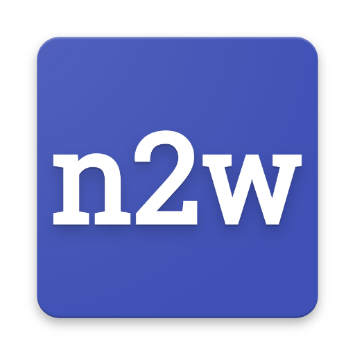

# Number to word (n2w)



A simple "number to word" service composed by a backend API service 
(python Flask powered) and a frontend PWA (Progressive Web Application).


## frontend PWA

Host static assets wherever you want and edit appropriately the website
URL (`https://number2word.appspot.com`) in source code.


## backend API service

### Setup
`pip install -r requirements.txt`

### Usage

Request (HTTP):
`GET /n2w/api/v1.0/get/NUMBER/LANGUAGE`

* NUMBER (mandatory) integer number (eg. `42`)
* LANGUAGE (optional) two letter language code (eg. `it`) - Default: `en`

Reply (JSON):
```
{
'number': 42,
'text': quarantadue,
'lang': it,
'created': 2017-11-07T01:00:00Z,
}
```

